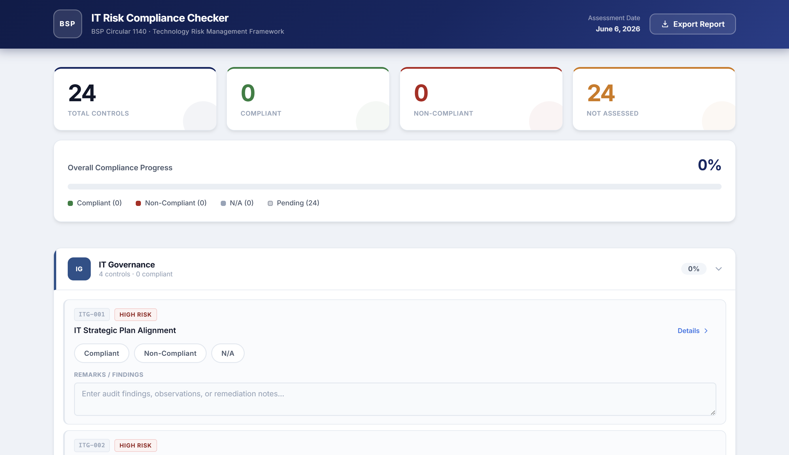

# 🏦 BSP IT Risk Compliance Checker

> A self-assessment tool for evaluating IT risk controls under **BSP Circular 1140** — Technology Risk Management Framework



<p align="left">
  
  
  
  
</p>

---

## 🔗 Live Demo

**[bsp-compliance-checker.vercel.app](https://bsp-compliance-checker.vercel.app)**

---

## Why This Exists

The Bangko Sentral ng Pilipinas (BSP) issued **Circular 1140** to establish a Technology Risk Management Framework for all BSP-supervised financial institutions (BSFIs). It mandates that banks, thrift institutions, and other covered entities assess and manage risks across IT governance, cybersecurity, business continuity, and third-party dependencies.

In practice, compliance teams conduct these assessments using spreadsheets or paper forms — tools that are slow, error-prone, and hard to aggregate. This project maps all major Circular 1140 IT risk control requirements into a structured, interactive checklist that generates a shareable compliance report in seconds.

It was built specifically to reflect the working reality of IT risk and audit roles in Philippine banking, where familiarity with BSP issuances is a baseline expectation.

---

##  Features

-  **24 mapped controls** — each tied to a specific BSP Circular 1140 requirement across 6 IT risk domains
-  **Live compliance dashboard** — animated stat cards showing compliant, non-compliant, and pending counts with an overall score
-  **Domain-grouped checklist** — collapsible sections per IT risk domain for focused review
-  **Three-state status selector** — mark each control as Compliant, Non-Compliant, or N/A with a single click
-  **Risk level badges** — High / Medium / Low tagging on every control for prioritization
-  **Remarks field** — free-text input per control for audit findings and remediation notes
-  **Export to TXT** — one-click download of a formatted compliance report with date, score, and all non-compliant items

---

##  Tech Stack

| Technology | Purpose |
|---|---|
| **React 19** | UI components and state management |
| **Vite 6** | Build tooling and dev server |
| **Plain CSS** | All styling — no frameworks or utility classes |
| **JavaScript ES2022+** | Application logic |
| **Vercel** | Deployment and hosting |

---

##  How to Run Locally

**Prerequisites:** Node.js 18+ and npm 9+

```bash
# 1. Clone the repository
git clone https://github.com/K-roksoo/bsp-compliance-checker.git
cd bsp-compliance-checker

# 2. Install dependencies
npm install

# 3. Start the development server
npm run dev
```

Open [http://localhost:5173](http://localhost:5173) in your browser.

```bash
# To build for production
npm run build

# To preview the production build locally
npm run preview
```

---

##  BSP Controls Covered

All controls are sourced from **BSP Circular 1140 — Technology Risk Management Framework**.

| Domain | Controls | Sample Requirements |
|---|:---:|---|
| **IT Governance** | 4 | IT strategic plan alignment, risk management framework, defined roles and responsibilities, performance reporting |
| **Cybersecurity** | 8 | Information security policy, access control, vulnerability management, incident response, MFA, security awareness, network segmentation, data encryption |
| **Business Continuity** | 4 | Business Continuity Plan (BCP), Disaster Recovery Plan (DRP), backup and restoration procedures, Business Impact Analysis (BIA) |
| **IT Operations** | 3 | Change management process, IT asset inventory, system and audit log management |
| **Third-Party Risk** | 3 | IT outsourcing risk assessment, vendor contract and SLA management, ongoing third-party monitoring |
| **Data Management** | 2 | Data classification and handling, data privacy and customer protection |

> **Note:** This tool is a self-assessment aid and study reference. It does not constitute official BSP examination findings or regulatory advice. Always refer to the latest BSP issuances and consult qualified compliance officers for authoritative guidance.

---

##  Author

Built by **Noah Alexander Djupvik**

-  LinkedIn: [linkedin.com/in/noah-alexander-djupvik-381713266](https://www.linkedin.com/in/noah-alexander-djupvik-381713266)
-  GitHub: [@K-roksoo](https://github.com/K-roksoo)

---

## 📄 License

This project is licensed under the [MIT License](LICENSE).
